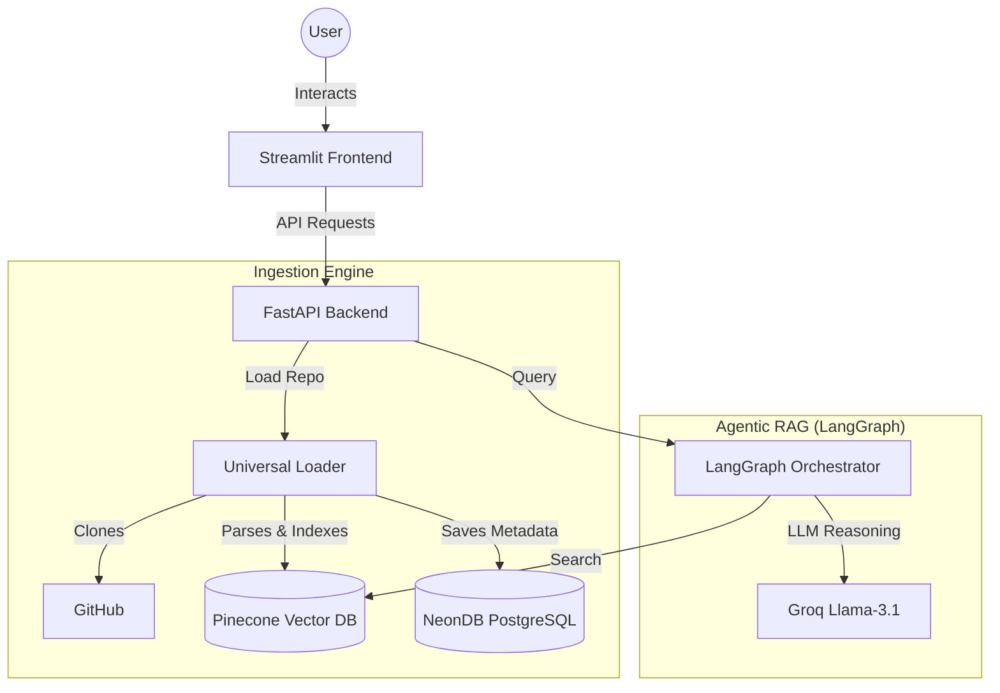
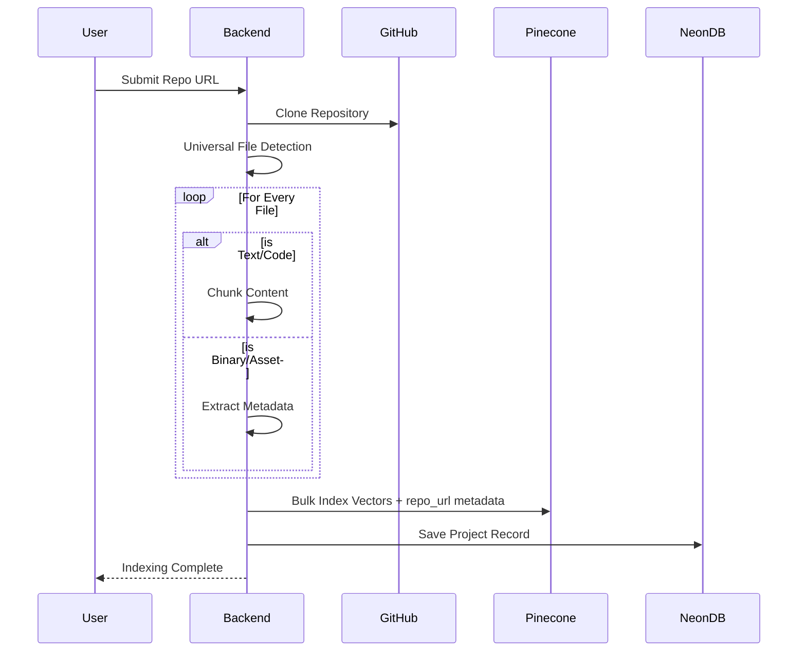
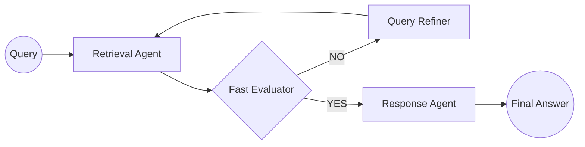

# 🏗️ RepoPilot Architecture

RepoPilot is built on a modular, agentic RAG architecture designed for multi-repository awareness and universal file indexing.

---

## 🛰️ System Overview

The system consists of three primary layers:
1.  **Frontend**: Streamlit-based dashboard for repo management and interactive chat.
2.  **Backend**: FastAPI server orchestrating data ingestion and agentic workflows.
3.  **Storage**: 
    *   **NeonDB (PostgreSQL)**: Stores project metadata and repository links.
    *   **Pinecone**: High-performance vector store for code and asset embeddings.

---

## 🔄 Core Workflows

### 1. Repository Indexing (Universal Loader)
RepoPilot uses a **Universal File Handler** to ensure no data is left behind:
- **Text/Code**: Files in any language are read, parsed using a language-aware approach, and split into chunks.
- **Assets/Binaries**: Images, PDFs, and binaries are indexed via **Metadata Documents** (Path, Filename, Size), allowing the agent to "see" the project structure even for non-text files.

### 2. Agentic RAG Flow (LangGraph)
Queries are processed through a cyclic graph of agents to maximize accuracy:
- **Retrieval Agent**: Fetch context snippets filtered strictly by the active `repo_url`.
- **Fast Evaluator**: Checks if retrieved context is sufficient.
- **Query Refiner**: If retrieval fails, rephrases the query for high-level project metadata.
- **Response Agent**: Synthesizes the final answer using multi-modal context.

---

## 📊 Data Storage Schema

### NeonDB (PostgreSQL)
- **Table**: `projects`
  - `id`: Primary Key
  - `name`: Repository Name
  - `repo_url`: Unique GitHub URL
  - `description`: Optional project info

### Pinecone (Vector Store)
- **Index Name**: `repopilotdb`
- **Metadata Fields**:
  - `source`: Relative file path
  - `repo_url`: Used for strict query isolation
  - `type`: `text`, `metadata`, or `asset`

---
*Architected for speed, accuracy, and universal codebase support.*
